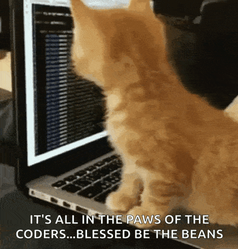

<h1 align="center">Hi 👋, I'm Rishita</h1>
<h3 align="center">Somewhere between hello world and ‘this is it!’ 🌍❤️</h3>

- 🎓 Computer Science @ KIIT — **because apparently Googling errors is a degree now*

- 🌱 I’m currently learning **ML & Frontend**

- 🧠 Trying to make sense of Deep Learning & LLMs **( More like deep confusion but I'm hanging in there)**
  
-  🖌️ Figma on the side — **design is half the fun**

-  🎨👀 secretly admiring Blender & Procreate from afar 

- 📫 How to reach me **siyapd28@gmail.com**

<h3 align="left">Connect with me:</h3>

<h3 align="left">Languages and Tools:</h3>

                 

&nbsp;

